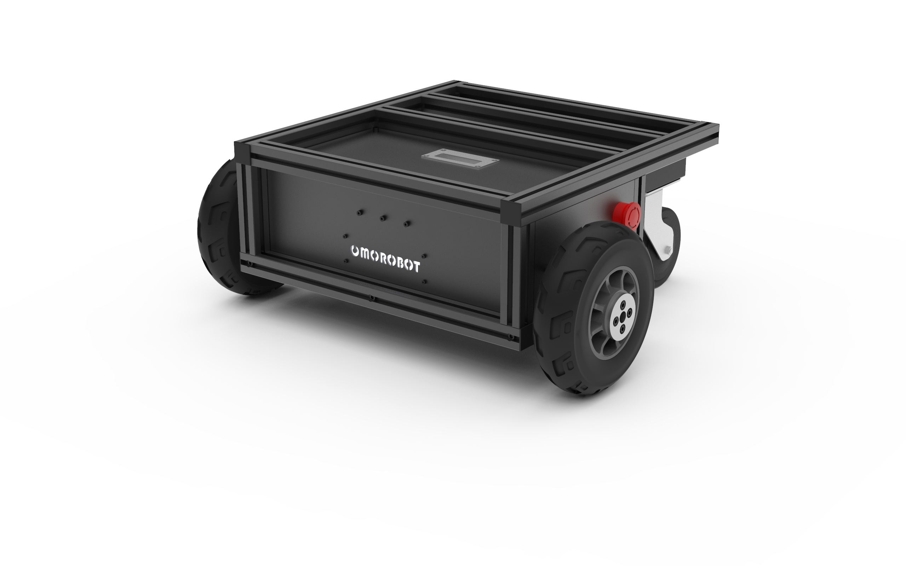
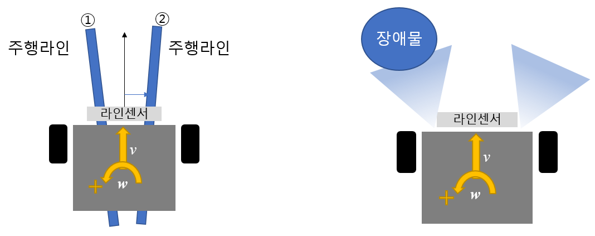
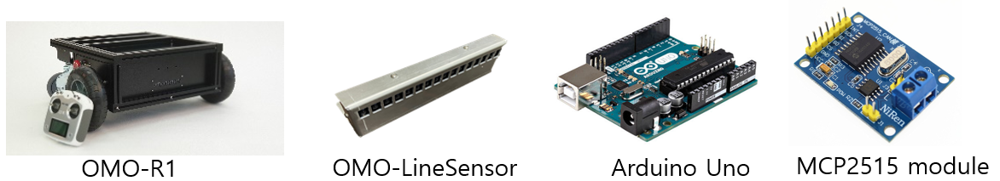
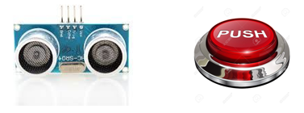
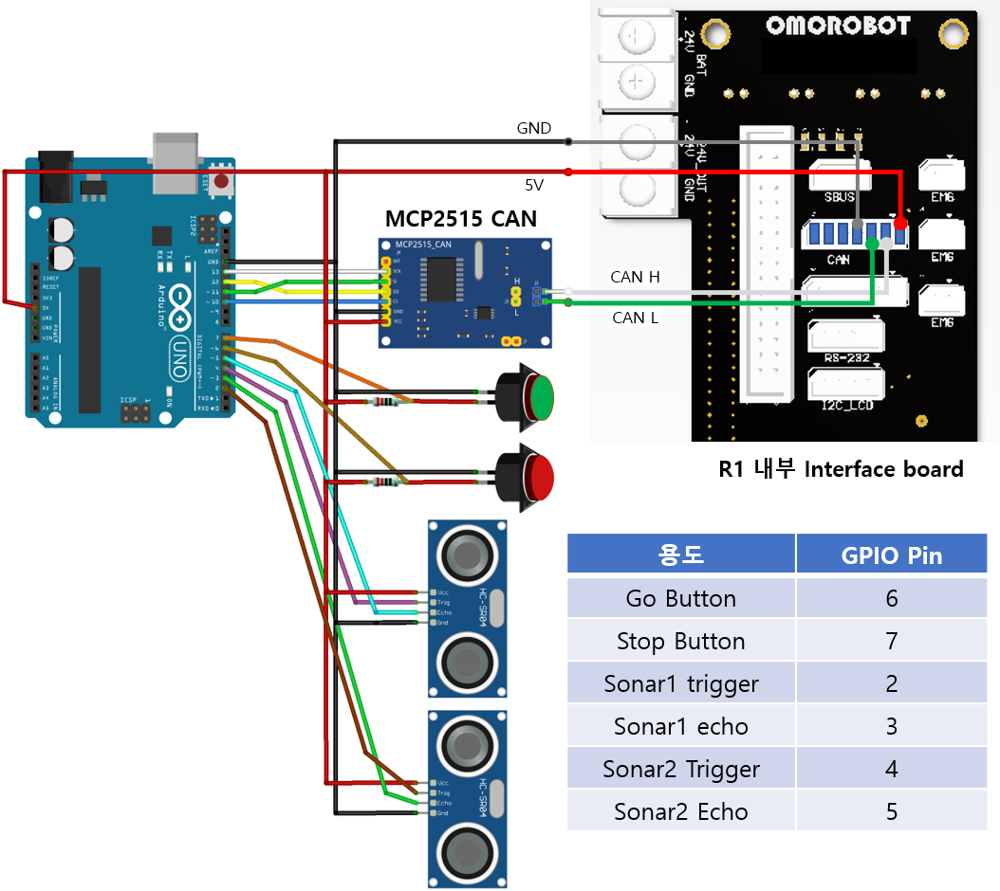
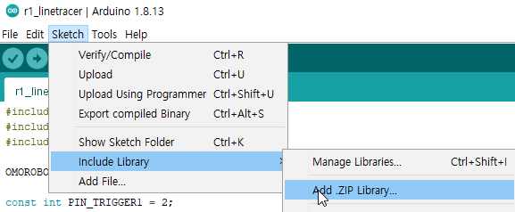

# OMODUINO

이 프로젝트는 아듀이노 보드를 사용하여 OMOROBOT의 R-1 로봇 플랫폼과 관련 센서 모듈을 통해 다양한 이동로봇 응용 프로그램을 제작하는데 도움이 되기 위해 작성된 라이브러리입니다.  
<div align="center">
  
</div>

## R-1 라인트레이서 소개

이 라이브러리를 확용하면 OMO-R1 플랫폼에 라인센서와 초음파 센서를 추가하여 바닥에 붙여진 반사테이프를 읽으면서 스스로 이동하는 AGV를 만들 수 있습니다.  
Go 버튼을 누르면 라인의 중심을 유지하면서 속도와 회전속도를 제어하며 따라갑니다. (주행 라인이 1번 위치에 있는 경우 왼쪽으로, 2번에 있는경우 우측으로 회전하는 원리입니다.)  
Stop 버튼을 누르면 정지합니다.  
장애물을 감지하면 로봇은 멈추고 장애물이 사라지면 다시 출발합니다.  

<div align="center">
  
</div>


## 필요한 장비 목록

예제 프로그램을 실행시키기 위해 다음과 같은 장치가 필요합니다.

 - OMOROBOT R1 플랫폼 [OMO-R1](https://www.omorobot.com/omo-r1)
 - OMOROBOT 라인센서: 라인 센서 구매는 sales@omorobot.com 으로 문의 바랍니다.
 - 아듀이노 우노 또는 호환 보드
 - 아듀이노용 MCP2515 CAN 통신 확장 모듈 [MCP2515 tutorial](https://www.electronicshub.org/arduino-mcp2515-can-bus-tutorial/)
<div align="center">
  
</div>

 - HC-SR04 초음파센서 모듈 및 버튼  
<div align="center">
  
</div>

## 전체 하드웨어 구성 및 연결 방법

전체 연결 방법은 아래 그림을 참조하십시오. 

<div align="center">
  
</div>

## 참조 라이브러리

 이 프로젝트는 다음 라이브러리를 참조합니다.
  - [arduino-mcp2515 라이브러리](https://github.com/autowp/arduino-mcp2515) 에서 zip 파일을 다운로드합니다.  
  - Arduino IDE를 열고 스케치 > Include Library > Add .ZIP Library 를 선택하여 다운로드한 파일을 선택  
<div align="center">
  
</div>

## 사용 방법

사용 방법을 익히는 가장 쉬운 방법은 example 폴더의 코드를 복사하여 실행하는 것입니다.  
Arduino IDE에서 새로운 프로젝트를 생성한 다음  
.ino 파일이 있는 폴더에 /src 폴더를 만들고 이 프로젝트를 git clone 하면 됩니다.  
또는 프로젝트 루트 폴더에 /src 폴더를 만들고 git repository를 zip파일로 다운로드 한 다음 압축을 해제합니다.  

### 클래스 선언

먼저 r1_driver.h 헤더를 include하고 클래스를 선언합니다.

```C++
#include "src/omoduino/r1_driver.h"

OMOROBOT_R1 r1;
```

### 콜백함수 추가

OMOROBOT_R1과 라인센서가 CAN으로 연결되어 정상적으로 통신이 이루어진 경우 ODO, 라인 위치, 라인 아웃에 관한 메세지를 받았을때 이를 콜백함수로 불러올 수 있습니다.  
다음 코드를 먼저 추가합니다.

```C++
void newR1_message_event(R1_MessageType msgType) {
   switch (msgType) {
   case R1MSG_ODO:
      break;
   case R1MSG_LINEPOS:
      break;
   case R1MSG_LINEOUT:
      break;
   default:
      break;
   }
}
```

### setup 설정

먼저 시리얼 포트를 연 다음 r1을 라인트레이서 모드로 설정하기 위해 set_driveMode에 R1DRV_LineTracer 타입을 전달합니다.  
2초 이상 lineout이 발생하는 경우 로봇을 정지하기 위해 set_lineoutTime에 2000ms 을 설정합니다.  
이제 모든 설정이 완료되었으므로 begin을 호출하여 동작을 시작합니다.  
앞서 작성한 콜백함수를 등록하기 위해 onNewData에 newR1_message_event 함수 이름을 전달합니다.

```C++
void setup() {
  Serial.begin(115200);
  r1.set_driveMode(R1DRV_LineTracer);
  r1.set_lineoutTime(2000);
  r1.onNewData(newR1_message_event);
  r1.begin();
```

### loop 함수 추가

OMOROBOT_R1 클래스를 동작시키기 위해 loop() 안에 spin()함수를 추가합니다.

```C++
r1.spin();
```

### 라인트레이서 구동

이제 R1을 라인트레이서로 구동하기 위한 모든 준비가 끝났습니다.  
로봇을 출발시키기 위해서는 go() 함수에 목표 속도를 전달하면 됩니다.
예를 들어 200mm/s 속도로 로봇을 이동시키려면 다음과 같이 호출합니다.

```C++
r1.go(200)
```

로봇을 정지시키기 위해서는 stop()을 호출합니다.
```C++
r1.stop();
```

잠시 멈추기 위해 속도를 0으로 변경하기 위해서는 pause()를 호출합니다.
```C++
r1.pause();
```

잠시 멈춤 상태에서 다시 출발하기 위해서는 go() 함수를 호출합니다.
```C++
r1.go();
```


----

## 라이센스 및 권리

이 소프트웨어는 (주)오모로봇 R1 플랫폼을 위하여 유규형 ([kyuhyoong@omorobot.com](kyuhyoong@omorobot.com "kyuhyoong@omorobot.com"))에 의해 작성되었으며 별다른 명시를 하지 않는 한 [GNU General Public License (GPLv2)](https://www.gnu.org/licenses/old-licenses/gpl-2.0.en.html)를 따릅니다.  
누구나 자유롭게 이 소프트웨어를 활용하여 R1 응용 프로그램을 작성하기 위하여 [포크](https://help.github.com/articles/fork-a-repo)하거나, 코드를 개선, 또는 변경하기 위해여 [풀링 요청](https://help.github.com/articles/using-pull-requests)을 할 수 있습니다.  
문제가 있거나 버그를 발견한 경우 issue에 남겨주시면 검토할 수 있지만 동작을 보장하지는 않습니다.
